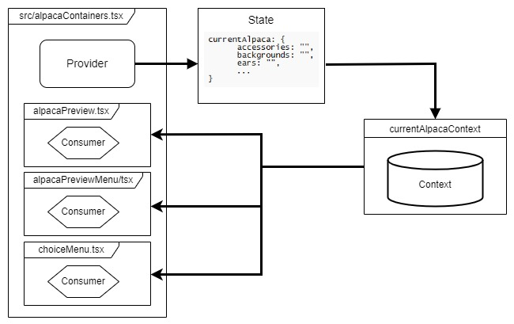

# Alpaca Generator

## Presentation
A little project which is a website that allow users to generate and download Alpaca avatar.

- Live demo available [here](https://mattordre44.github.io/alpaca_generator/)

This was made thanks to Front-end framework ReactJS in Typescript, this might not be appropriate for simple app like 
this, but it is useful to train on react main concepts such as function components, react hook : useState, useCallback, 
useEffect and so on. Moreover, this app was built using react context which permit to pass data through the component 
tree without having to pass props down at every component's level.



In addition, in provider there are callable methods by consumer to update the context state, download image or generate
a random alpaca

## Launch the app locally or build it
```shell
# Start on a local server
$ npm run start

# Build & generate static files
$ npm run build  
```
___


